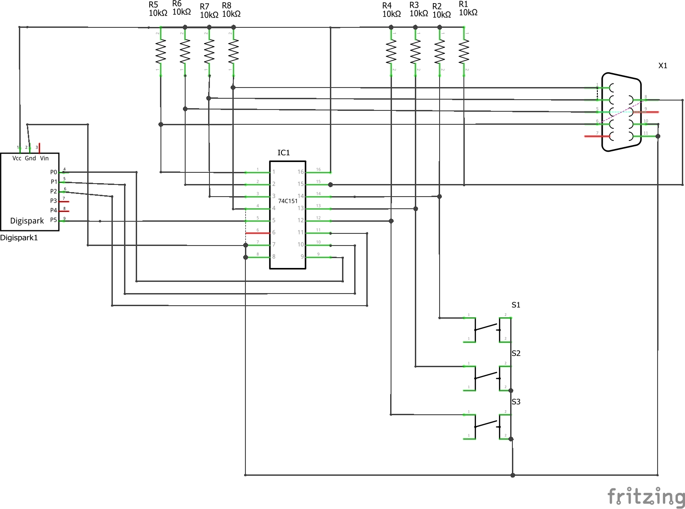
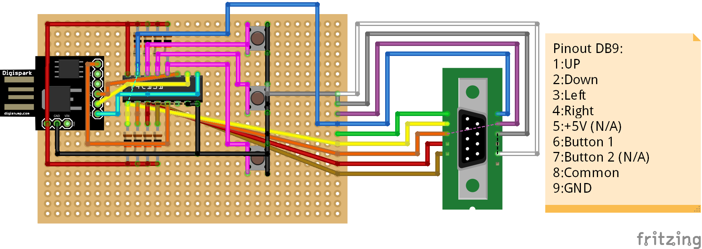

# Digispark C64 Joystick Adapter
The retro console ["The C64"](https://retrogames.biz/thec64) or
["The C64 mini"](https://retrogames.biz/thec64-mini) comes with a USB Joystick.
To add a second joystick you can buy a
["The C64 Joystick"](https://retrogames.biz/thec64-joystick) or you can use one
of several working alternatives. Unfortunately, the controllers I had lying around
did not work.

But I had an old digital joystick. And with the Digispark controller board a
"USB"-device can be emulated. Even though it is no fully qualified "USB"-protocol,
the device works on most machines. So I gave it a try - and it WORKED!

## Status
The digispark controller starts the bootloader first and indicates as a
digispark-bootloader. After the timeout of about 5 seconds it resets the USB-device
and starts as a USB-Joystick. If it is connected to the "The C64 mini" on powerup
it confuses the retro console and it is not detected correctly. But if connecting or
reconnecting while in the carousel mode of the retro console it is detected and 
can be tested before starting any game. I also added 3 buttons for "fire 2" and the
extra two buttons. For more buttons I had no pins left, but this sould be enough.

To ensure that the joystick will work I analyzed the real "The C64 Joystick" and
emulated it. So it will also work with future firmware, because the own joystick
they will allways support ;-)

## SW Requirements
* [Arduino IDE](https://www.arduino.cc/en/main/software)
* Install [Digistump connection for Arduino IDE](https://digistump.com/wiki/digispark/tutorials/connecting)
* [Adapted Digispark joystick library](https://github.com/grafmar/DigisparkJoystickC64-Library) to emulate "The C64 Joystick"

## Hardware
The hardware consists of:
* Digispark board
* 74C151 8-input multiplexer
* DB9 connector to connect the joystick
* pullup resistors (~10k)
* buttons

The Digispark board has only 6 IOs, whereas P3 and P4 are used for USB. P5 is also used as reset, but
this depends on the fuses set on the ATtiny85 on the Digispark. I had to change this fuses to have all IOs
available. The downside is, that you can't program the ATtiny85 anymore using a low-voltage
programmer. You need a special programmer. But because the Digispark has a bootloader it
can easaly be programmed using the Arduino IDE and the bootloader. And I don't thing I have
to reprogram the bootloader any time soon ;-)

To connect the digital joystick to the digispark controller, I used a 8-input multiplexer. Like this
I can scan through the 8 inputs using 3 address signals and reading the output of the multiplexer.
So I use only 4 IOs (3 Out, 1 In). The 8 inputs are normally high using pull-up resistors. The
joystick connects the input to GND by its common line. Like this I can read 8 input signals, wherefrom
4 direction and 1 fire signal come from the joystick. The remaining 3 inputs are connected to tactile
switches, to be also able to use them als extra buttons.

### Schematic

### Perfboard

## Housing / Enclosure
The housing is printed using a 3D-Printer. It depends on how the hardware is built up
but there it is and it can also be adapted.

## Author
[Marco Graf](https://github.com/grafmar)
